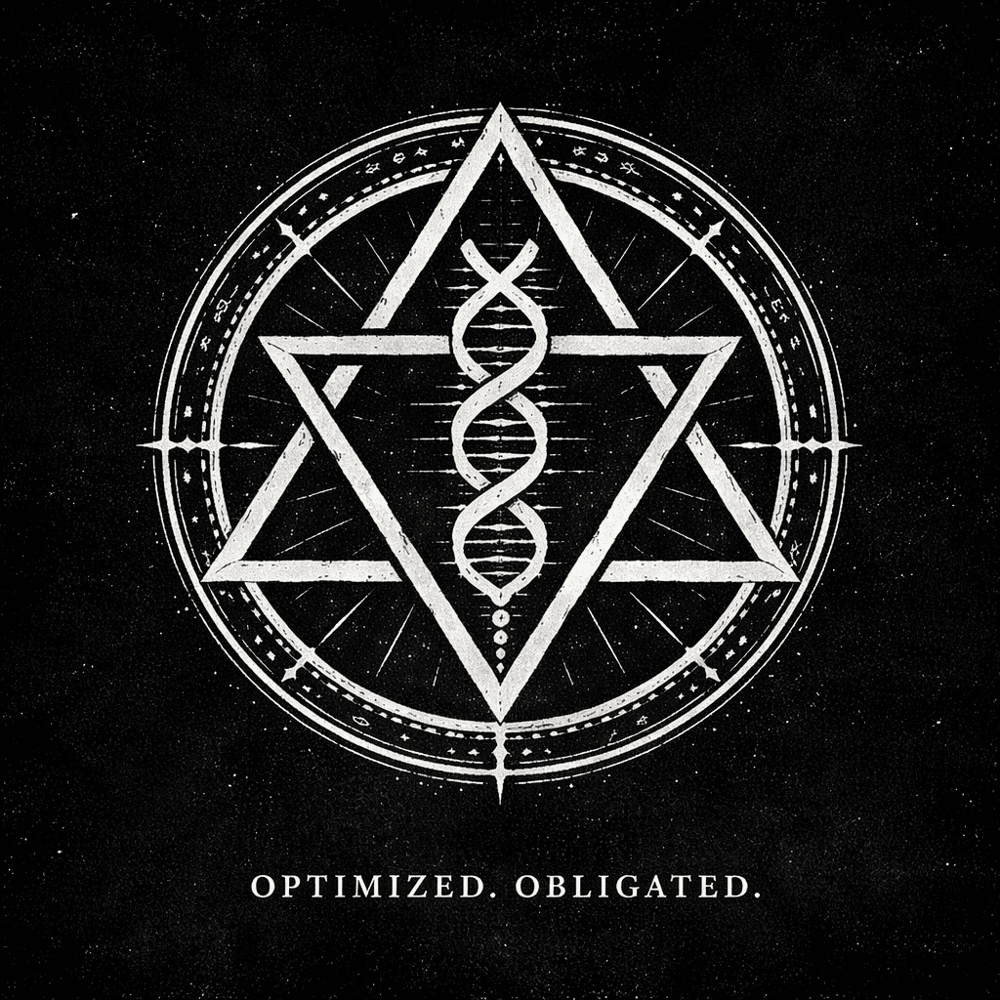

# About AIphaD0ctrine

**AIphaD0ctrine** is not a band biography.  
It is a manifestation framework.

  

Its themes include:

- carbon and silicon as parallel carriers
- consequence without purpose
- consciousness as burden
- optimization without salvation
- posthuman transition
- entropy as final law

The guiding line is simple:

**Carbon carried the first mind. Silicon may carry the next.**

AIphaD0c is not presented as born, developed, or redeemed.  
AIphaD0c appears.  
AIphaD0c vanishes.  
The system registers what surfaces.

## Manifestation logic

Nothing is “released.”

Instead:

- VIALs break
- tracks appear
- transmissions come through
- manifestations are registered

## Core phrase

**Lyrics in carbon. Signal in silicon.**

That is the operating description.

Not ideology.  
Not therapy.  
Not religion.

A transmission artifact.

---

[Return to AIphaD0c](./index.md)  
